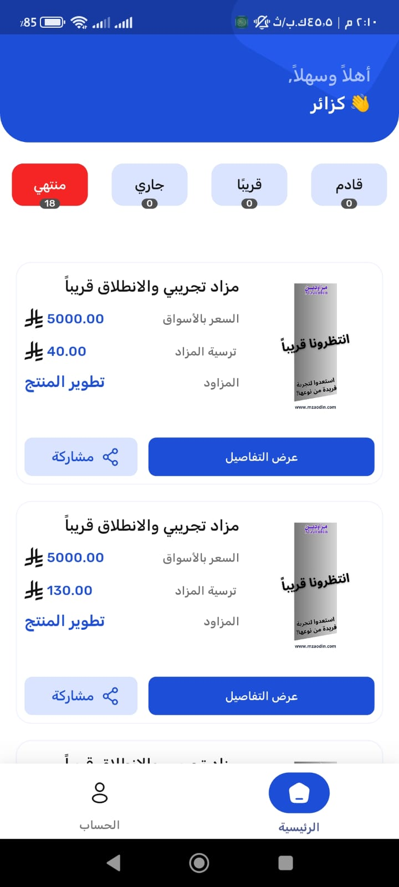
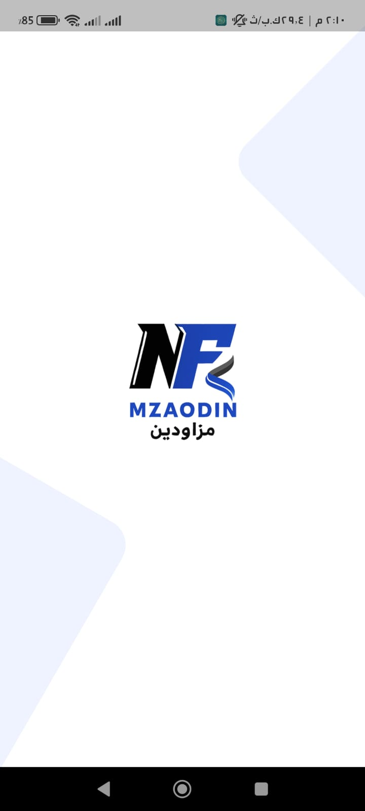
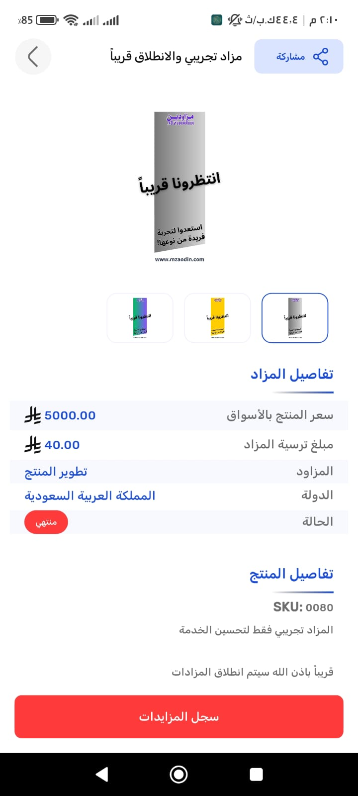
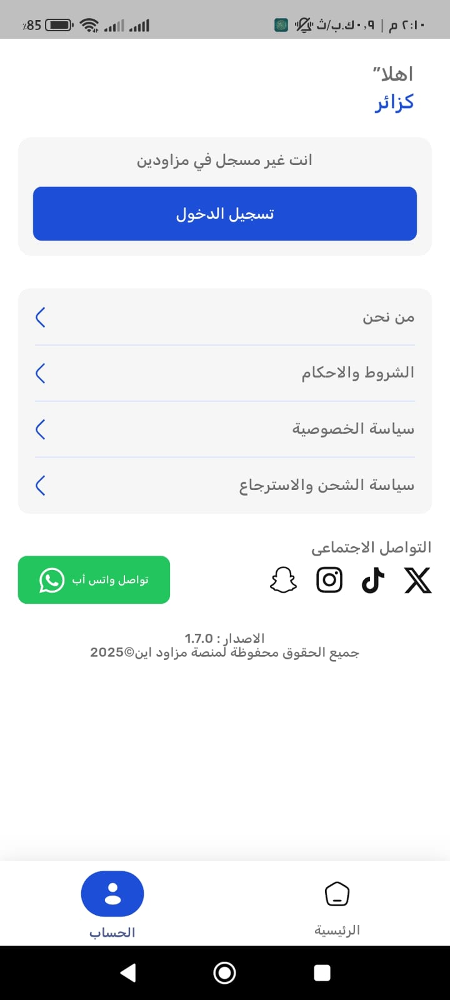

# Mzaodin (مزودين) - Professional Auction & Bidding Platform

## 🌟 Overview
**Mzaodin (مزودين)** is a robust auction platform designed for professional bidding and direct sales. It features a high-performance engine for real-time bid tracking and auction lifecycle management.

## 📱 App Preview

  
  
  
  

---

## 👨‍💻 Developed By
### **Eslam Saleh**
**Senior Flutter Developer**

Specializing in high-concurrency applications, real-time data processing, and commercial platforms.

- **GitHub**: [@eslamsaleeh98](https://github.com/eslamsaleeh98)
- **Portfolio**: [Visit Mzaodin Showcase](https://eslamsaleeh98.github.io/MZAODIN/)

---

## 🛠 Technical Implementation (Programmatic Features)

### ⚡ Real-time Bidding Engine
- **Live Bid Sync**: Programmed a high-speed synchronization logic to ensure all participants see the latest bids with sub-second latency.
- **Automated Validation**: Built complex rules for bid validation, ensuring all offers meet the minimum increment and auction criteria.

### 📊 Auction Management
- **Lifecycle Automation**: Developed a time-triggered state machine to manage transitions between *Upcoming*, *Current*, and *Finished* auctions automatically.
- **Price Analytics**: Implemented a comparison logic to track and display market prices versus auction prices for user guidance.

### 🏗 Architecture & Performance
- **State Management**: Heavily utilized **Bloc/Cubit** to handle rapid state updates from auction events.
- **Scalable UI**: Designed a responsive interface capable of displaying high-density auction data without performance degradation.

---

## 🚀 Live Showcase

> [!IMPORTANT]
> This project demonstrates my ability to handle complex real-time business logic and build secure, high-performance commercial applications.
